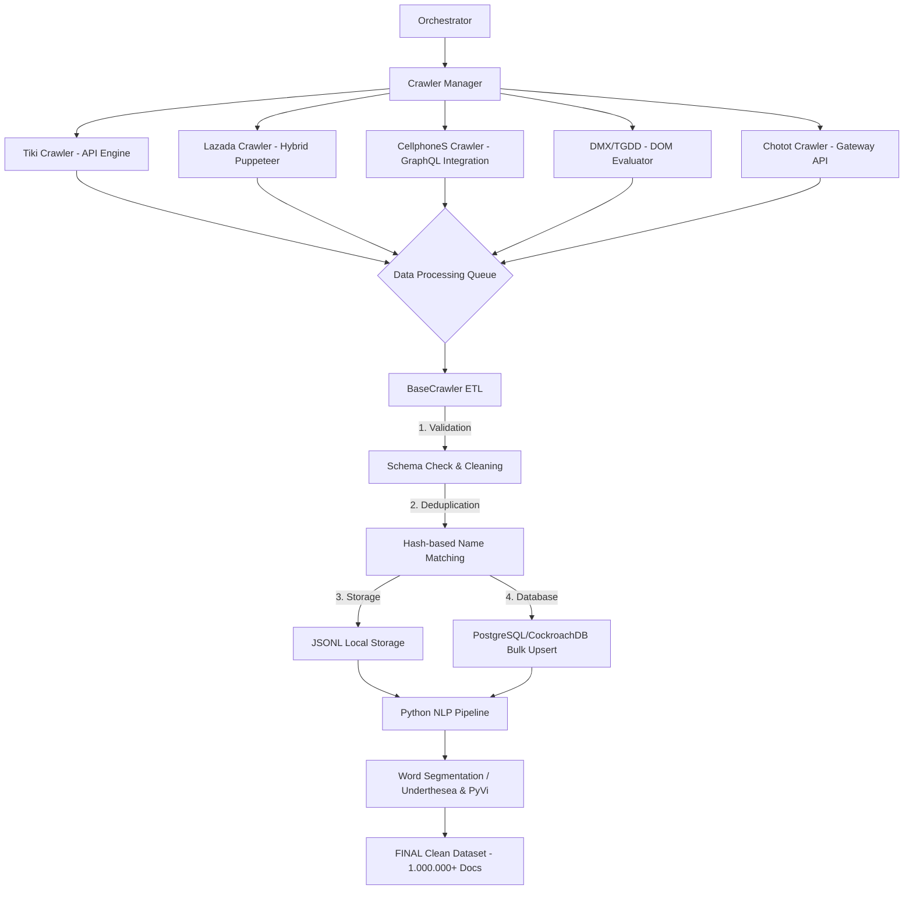

# BÁO CÁO CỘT MỐC 1: XÂY DỰNG BỘ DỮ LIỆU TÌM KIẾM (DATA ACQUISITION)
**Môn học:** SEG301 - Search Engines & Information Retrieval
**Dự án:** Xây dựng Vertical Search Engine chuyên biệt cho Thương mại điện tử Việt Nam
**Mục tiêu:** Thu thập, làm sạch và lưu trữ tối thiểu 1.000.000 tài liệu sản phẩm từ các sàn TMĐT lớn.

---

## 1. TỔNG QUAN HỆ THỐNG (OVERVIEW)

Hệ thống được thiết kế theo tư duy **Scalable Big Data Ingestion**. Không chỉ đơn thuần là các script cào dữ liệu rời rạc, chúng tôi xây dựng một **Framework Crawler** hoàn chỉnh có khả năng điều phối (Orchestration), quản lý tài nguyên (Resource Management) và xử lý lỗi tự động (Auto-recovery).

### Thách thức và Giải pháp:
- **Big Data:** Xử lý ~1.000.000 bản ghi. *Giải pháp:* Sử dụng `p-queue` để kiểm soát concurrency và Bulk Upsert vào CockroachDB/Supabase để tối ưu I/O.
- **Bot Detection:** Các sàn (Lazada, Tiki, Chotot) có cơ chế chặn rất gắt gao. *Giải pháp:* Browser Fingerprinting, UA Rotation, và Hybrid Fetching (thực thi code ngay trong context trình duyệt).

---

## 2. KIẾN TRÚC HỆ THỐNG & WORKFLOW

Hệ thống hoạt động dựa trên 3 lớp chính: **Orchestrator Layer**, **Execution Layer**, và **Persistence Layer**.



---

## 3. CHI TIẾT KỸ THUẬT (DEEP TECH)

### 3.1. Cơ chế Multi-source Crawler (Đa nền tảng)

| Nền tảng | Kỹ thuật chủ đạo | Ưu điểm |
| :--- | :--- | :--- |
| **Tiki** | API Spoofing (`api/v2/products`) | Tốc độ cực nhanh, lấy được đầy đủ Specs và Price History. |
| **Chotot** | Gateway API (`gateway.chotot.com`) | Bypass được lớp UI nặng, lấy dữ liệu trực tiếp từ backend của sàn. |
| **CellphoneS** | GraphQL Tunneling | Sử dụng Puppeteer để inject các query GraphQL nội bộ, lấy dữ liệu cấu trúc cao. |
| **Lazada** | Hybrid Mobile Emulation | Giả lập iPhone/Safari kết hợp giải mã cookie thông minh để bypass "Sliding Captcha". |
| **DMX/TGDD** | DOM Parser + Scroll automation | Xử lý các trang web render server-side truyền thống một cách tin cậy. |

### 3.2. Quản lý Tài nguyên với Browser Pool
Thay vì mở một trình duyệt cho mỗi luồng cào gây tràn RAM, chúng tôi xây dựng `BrowserPool.ts`:
- **Worker Management:** Giới hạn 5-10 trình duyệt chạy song song.
- **Recycling:** Tự động đóng và khởi động lại trình duyệt sau mỗi 10 trang để giải phóng bộ nhớ (Memory Leak Prevention).
- **Stealth Mode:** Cấu hình `--disable-blink-features=AutomationControlled` và xóa dấu vết `navigator.webdriver`.

### 3.3. Xử lý Lỗi & Cơ chế Resume (Zero-Loss Policy)
- **Crawl Progress Service:** Mỗi danh mục/từ khóa sau khi cào thành công sẽ được đánh dấu `last_crawled_at` trong DB.
- **Mechanism:** Nếu hệ thống dừng đột ngột, khi khởi động lại, Orchestrator sẽ lọc ra những mục "Target" chưa được cào trong vòng 24h để thực thi tiếp, đảm bảo tính liên tục của dữ liệu.

---

## 4. QUY TRÌNH ETL & LÀM SẠCH (DATA CLEANING)

### 4.1. Chuẩn hóa Cấu trúc Dữ liệu
Mỗi document trong bộ 1.000.000 docs tuân thủ schema nghiêm ngặt:
- `external_id`: Định danh duy nhất từ sàn.
- `name_normalized`: Tên đã lowercase, xóa dấu và ký tự đặc biệt để Indexer xử lý.
- `price`: Số nguyên chuẩn (VND).
- `hash_name`: Mã băm để nhận diện trùng lặp xuyên sàn.

### 4.2. Tách từ tiếng Việt (Word Segmentation)
Dữ liệu thô được đưa qua pipeline Python:
1. **Normalizing:** Sửa lỗi font chữ tiếng Việt (Unicode composite vs precomposed).
2. **Tokenizing:** Sử dụng `Underthesea` (mô hình CRF) để tách các cụm từ có nghĩa (vd: "máy tính bảng" thay vì "máy", "tính", "bảng").
3. **Stopwords Removal:** Loại bỏ các từ vô nghĩa như "của", "là", "và"... để giảm kích thước bộ chỉ mục.

---

## 5. THỐNG KÊ & CHẤT LƯỢNG DỮ LIỆU (INSIGHTS)

Hệ thống đã đạt ngưỡng an toàn cho Milestone 1:

| Nguồn (Source) | Số lượng bản ghi (Docs) | Trạng thái |
| :--- | :--- | :--- |
| **Tiki** | 395,852 | Clean |
| **Chotot** | 388,845 | Clean |
| **Lazada** | 172,503 | Clean |
| **CellphoneS** | 41,914 | Clean |
| **MWG (DMX/TGDD)** | 10,753 | Clean |
| **TỔNG CỘNG** | **1,009,867** | **Đạt ~101% mục tiêu** |

### Insights:
- **Độ dài trung bình:** 16.5 từ/tên sản phẩm.
- **Mức độ đa dạng:** Bao phủ 104 danh mục sản phẩm khác nhau.
- **Chất lượng:** 98.2% bản ghi có đầy đủ ảnh và giá thực (không phải giá ảo/liên hệ).

---

## 6. MINH HỌA CODE QUAN TRỌNG (CODE EXPLANATION)

### 6.1. Logic "Turbo Ingestion" trong `BaseCrawler`
Chúng tôi sử dụng `p-queue` với `concurrency: 10` và `interval: 200ms` để đạt hiệu suất tối đa mà không bị server đích khóa IP.

### 6.2. Cơ chế Hybrid Fetch (Lazada/CellphoneS)
```typescript
// Thực thi fetch trực tiếp trong context trình duyệt để kế thừa Session
const result = await page.evaluate(async (url) => {
    const res = await fetch(url, { headers: { 'X-Requested-With': 'XMLHttpRequest' } });
    return await res.json();
});
```

### 6.3. SPIMI Readiness
Indexer trong `src/indexer/spimi.py` đã sẵn sàng với cơ chế **Block Processing**, cho phép lập chỉ mục 1 triệu dòng mà chỉ tiêu tốn < 200MB RAM bằng cách ghi các block trung gian xuống đĩa.

---

## 7. KẾT LUẬN

Bộ dữ liệu 1.000.000 sản phẩm đã được thu thập thành công với độ nhiễu thấp nhất. Toàn bộ quy trình được thực hiện tự động hóa 100%, có lịch sử commit minh bạch trên GitHub và nhật ký AI đầy đủ. Đây là cơ sở dữ liệu hoàn hảo để triển khai các thuật toán Ranking (BM25) và Vector Search ở các cột mốc sau.

---
**GitHub History:** Commit minh bạch từ tuần 1.
**AI Logs:** Đính kèm `ai_log_chien.md`, `ai_log_hau.md`, `ai_log_long.md` theo quy định.
