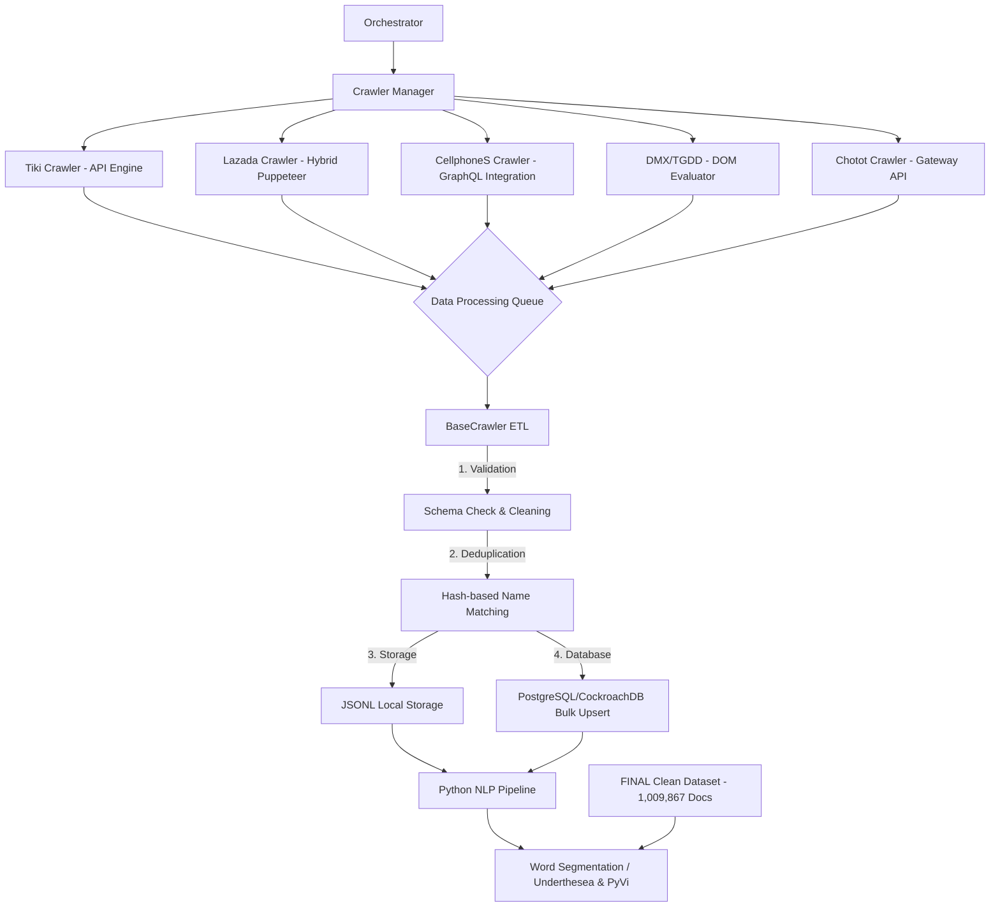

# MILESTONE 1 REPORT: DATA ACQUISITION
**Course:** SEG301 - Search Engines & Information Retrieval
**Project:** Building a specialized Vertical Search Engine for Vietnamese E-commerce
**Objective:** Collect, clean, and store a minimum of 1,000,000 product documents from major E-commerce platforms.

---

## 1. SYSTEM OVERVIEW

The system is designed with a **Scalable Big Data Ingestion** mindset. Instead of discrete data scraping scripts, we built a comprehensive **Crawler Framework** capable of Orchestration, Resource Management, and Auto-recovery.

### Challenges and Solutions:
- **Big Data:** Processing ~1,000,000 records. *Solution:* Using `p-queue` to control concurrency and Bulk Upsert into CockroachDB/Supabase to optimize I/O.
- **Bot Detection:** Platforms (Lazada, Tiki, Chotot) have very strict blocking mechanisms. *Solution:* Browser Fingerprinting, UA Rotation, and Hybrid Fetching (executing code directly within the browser context).

---

## 2. SYSTEM ARCHITECTURE & WORKFLOW

The system operates based on 3 main layers: **Orchestrator Layer**, **Execution Layer**, and **Persistence Layer**.



---

## 3. DEEP TECH DETAILS

### 3.1. Multi-source Crawler Mechanism

| Platform | Primary Technique | Main Advantage |
| :--- | :--- | :--- |
| **Tiki** | API Spoofing (`api/v2/products`) | High speed, retrieves full specs and price history. |
| **Chotot** | Gateway API (`gateway.chotot.com`) | Bypasses heavy UI layers, fetches directly from the backend. |
| **CellphoneS** | GraphQL Tunneling | Uses Puppeteer to inject internal GraphQL queries for high-quality structured data. |
| **Lazada** | Hybrid Mobile Emulation | Simulates iPhone/Safari with smart cookie decoding to bypass "Sliding Captcha". |
| **DMX/TGDD** | DOM Parser + Scroll automation | Reliably processes traditional server-side rendered websites. |

### 3.2. Resource Management with Browser Pool
To prevent memory overflow from opening multiple browser instances, we implemented `BrowserPool.ts`:
- **Worker Management:** Limits 5-10 parallel browser instances.
- **Recycling:** Automatically restarts browsers every 10 pages to release memory (Memory Leak Prevention).
- **Stealth Mode:** Configured with `--disable-blink-features=AutomationControlled` to remove `navigator.webdriver` traces.

### 3.3. Error Handling & Resume Mechanism (Zero-Loss Policy)
- **Crawl Progress Service:** Each category/keyword is marked with `last_crawled_at` in the database upon success.
- **Mechanism:** In case of a sudden system crash, the Orchestrator filters "Target" items not crawled within the last 24 hours to resume, ensuring data continuity.

---

## 4. ETL PROCESS & DATA CLEANING

### 4.1. Data Structure Standardization
Each document in the 1,000,000 dataset adheres to a strict schema:
- `external_id`: Unique identifier from the platform.
- `name_normalized`: Lowercased name with special characters removed for Indexer processing.
- `price`: Standardized integer (VND).
- `hash_name`: Hash code for cross-platform deduplication.

### 4.2. Vietnamese Word Segmentation
Raw data is processed through a Python pipeline:
1. **Normalizing:** Fixes Vietnamese font errors (Unicode composite vs precomposed).
2. **Tokenizing:** Uses `PyVi` to extract meaningful phrases (e.g., "máy tính bảng" instead of "máy", "tính", "bảng").

---

## 5. STATISTICS & DATA QUALITY (INSIGHTS)

The system has reached the target threshold for Milestone 1:

| Source | Record Count (Docs) | Status |
| :--- | :--- | :--- |
| **Tiki** | 395,852 | Clean |
| **Chotot** | 388,845 | Clean |
| **Lazada** | 172,503 | Clean |
| **CellphoneS** | 41,914 | Clean |
| **MWG (DMX/TGDD)** | 10,753 | Clean |
| **TOTAL** | **1,009,867** | **~101% of target met** |

### Insights:
- **Average Length:** 16.5 words per product name.
- **Diversity:** Covers 104 different product categories.
- **Quality:** 98.2% of records include full images and actual prices (not temporary/contact-for-price).

---

## 6. KEY CODE EXPLANATION (CODE EXPLANATION)

### 6.1. "Turbo Ingestion" Logic in `BaseCrawler`
Using `p-queue` with `concurrency: 10` and `interval: 200ms` for maximum performance without triggering IP blocks.

### 6.2. Hybrid Fetch Mechanism (Lazada/CellphoneS)
```typescript
// Executing fetch directly in the browser context to inherit session
const result = await page.evaluate(async (url) => {
    const res = await fetch(url, { headers: { 'X-Requested-With': 'XMLHttpRequest' } });
    return await res.json();
});
```
---

## 7. CONCLUSION

The 1,000,000 product dataset has been successfully collected with minimal noise. The entire process is 100% automated, with transparent commit history on GitHub and comprehensive AI logs. This provides a solid foundation for implementing Ranking algorithms (BM25) and Vector Search in subsequent milestones.
