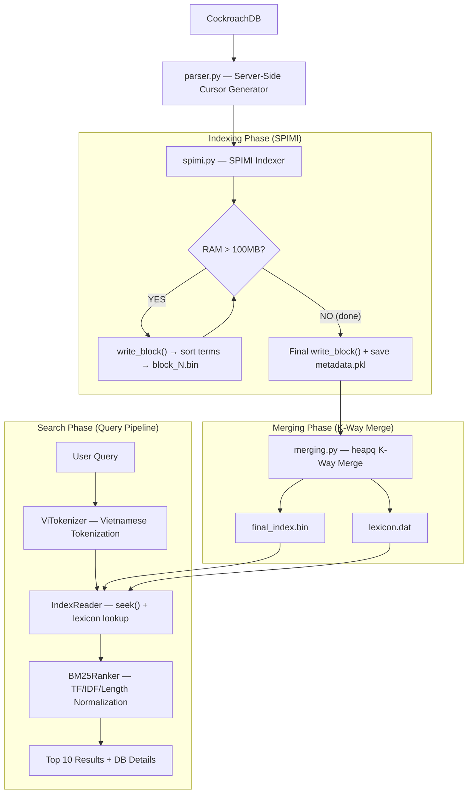

# MILESTONE 2 REPORT: CORE SEARCH ENGINE
**Course:** SEG301 - Search Engines & Information Retrieval
**Project:** Building a specialized Vertical Search Engine for Vietnamese E-commerce
**Objective:** Implement the core indexing and ranking algorithms from scratch — SPIMI Indexing and BM25 Ranking — then expose them via a functional Console Application.

---

## 1. SYSTEM OVERVIEW

Milestone 2 focuses on the **algorithmic heart** of a Search Engine. Instead of relying on third-party IR libraries, every component is implemented from first principles:

- **SPIMI (Single-Pass In-Memory Indexing):** Processes documents by streaming them in blocks, building partial inverted indices in RAM, and flushing them to disk — completely avoiding memory overflow.
- **K-Way Merge:** Merges all on-disk blocks into a single, sorted **Inverted Index** binary file, supported by a **Lexicon** for O(1) term lookup.
- **BM25 Ranker:** Scores documents against a query by computing TF, IDF, and document length normalization — all implemented manually using NumPy vectorization without any external ranking library.
- **Console App:** A command-line interface that ties all components together, allowing users to build the index and perform interactive searches.

---

## 2. SYSTEM ARCHITECTURE & WORKFLOW

The pipeline is composed of 4 sequential stages, from raw data to ranked results:



---

## 3. DEEP TECH DETAILS

### 3.1. Data Ingestion — Server-Side Streaming Generator (`parser.py`)

To avoid loading all documents into RAM simultaneously, we use a **server-side named cursor**. This approach fetches data in configurable micro-batches of 1,000 rows at a time and converts each row into a token stream for the indexer:

```python
# src/crawler/parser.py
with conn.cursor(name='product_cursor') as cursor:
    cursor.execute("SELECT id, name_normalized FROM raw_products")
    while True:
        rows = cursor.fetchmany(size=1000)   # stream 1000 rows at a time
        if not rows:
            break
        for row in rows:
            doc_id = str(row[0])
            tokenized_name = ViTokenizer.tokenize(row[1]).split()
            yield doc_id, tokenized_name     # Generator: zero extra memory
```

**Key advantage:** The generator `yield`s `(doc_id, tokens)` tuples one at a time. The SPIMI Indexer consumes these lazily — eliminating any need to pre-load the full dataset.

Vietnamese-specific tokenization via `PyVi`'s `ViTokenizer` ensures multi-word tokens (e.g., `tai_nghe` for "tai nghe") are correctly treated as a single term, dramatically improving retrieval quality for Vietnamese product names.

---

### 3.2. SPIMI Indexer (`spimi.py`)

**SPIMI (Single-Pass In-Memory Indexing)** is a memory-safe algorithm for building large inverted indices. It processes documents in a single pass without requiring the entire dataset in RAM.

#### Core Algorithm:
```python
# src/indexer/spimi.py
def run_indexing(self, doc_generator):
    for doc_id, tokens in doc_generator:
        # Track document length for BM25 metadata
        self.doc_lengths[doc_id] = len(tokens)
        self.total_length += len(tokens)
        self.doc_count += 1

        # Accumulate TF counts: dictionary[term][doc_id] += 1
        for term in tokens:
            self.dictionary[term][doc_id] = \
                self.dictionary[term].get(doc_id, 0) + 1

        # Memory Guard: flush to disk if RAM limit exceeded
        if sys.getsizeof(self.dictionary) >= self.block_size_limit:
            self.write_block()

    if self.dictionary:
        self.write_block()      # flush remainder
    self.save_metadata()        # persist BM25 stats
```

#### Block Writing (`write_block`):
Each block is flushed by **sorting terms alphabetically** then serializing to a binary `.bin` file via `pickle`. After writing, the in-memory dictionary is cleared:

```python
def write_block(self):
    sorted_terms = sorted(self.dictionary.keys())
    block_data = [(term, self.dictionary[term]) for term in sorted_terms]
    with open(block_filename, 'wb') as f:
        pickle.dump(block_data, f)
    self.dictionary = defaultdict(dict)  # free RAM
```

#### Why This Works for 1M Docs:
| Concern | Solution |
|:---|:---|
| **RAM overflow** | Block limit of 100MB; flush to disk when exceeded |
| **Data continuity** | Generator streams docs one at a time |
| **BM25 metadata** | `doc_lengths`, `N`, `total_length` persisted to `metadata.pkl` |
| **Sorted blocks** | Each block internally sorted for K-Way Merge compatibility |

**Result:** Documents are processed and written to multiple `block_N.bin` files on disk.

---

### 3.3. K-Way Merge (`merging.py`)

After SPIMI produces N sorted block files, **K-Way Merge** combines them into a single, globally sorted **Inverted Index** — while simultaneously building a **Lexicon** (term directory) for fast random access.

#### Algorithm — `heapq`-based Min-Heap:
```python
# src/indexer/merging.py
import heapq

heap = []
# Seed the heap with the first term from each block iterator
for i, it in enumerate(iterators):
    term, postings = next(it)
    heapq.heappush(heap, (term, i, postings))

while heap:
    term, idx, postings = heapq.heappop(heap)

    if term == current_term:
        current_postings.update(postings)      # merge same-term postings
    else:
        # Serialize and write previous term's postings
        data_bytes = pickle.dumps(current_postings)
        lexicon[current_term] = {'offset': offset, 'length': len(data_bytes)}
        out_f.write(data_bytes)
        offset += len(data_bytes)
        current_term, current_postings = term, postings

    # Advance the exhausted block's iterator
    next_term, next_postings = next(iterators[idx])
    heapq.heappush(heap, (next_term, idx, next_postings))
```

#### Output Files:
| File | Content |
|:---|:---|
| `src/indexer/final_index.bin` | Serialized postings per term, in sorted order |
| `src/indexer/lexicon.dat` | `{term: {offset, length}}` — loaded fully into RAM |

**Retrieval mechanism (`reader.py`):** Given a query term, the `IndexReader` performs a **constant-time lexicon lookup** to get `offset` and `length`, then uses `file.seek(offset)` + `file.read(length)` for a single disk read — no full index scan required.

---

### 3.4. BM25 Ranker (`bm25.py`)

BM25 (Best Match 25) is the industry-standard probabilistic ranking function. Every component — TF, IDF, and length normalization — is computed manually using NumPy vectorization for performance.

#### Formula:
$$\text{Score}(d, q) = \sum_{t \in q} \text{IDF}(t) \cdot \frac{\text{tf}(t,d) \cdot (k_1 + 1)}{\text{tf}(t,d) + k_1 \cdot \left(1 - b + b \cdot \frac{|d|}{\text{avgdl}}\right)}$$

**Parameters used:** `k1 = 1.5`, `b = 0.75` (standard BM25 defaults).

#### Vectorized Implementation (NumPy):
```python
# src/ranking/bm25.py
for term in query_terms:
    postings = candidate_postings[term]   # {doc_id: tf}
    df = len(postings)

    # Manual IDF — Robertson-Sparck Jones formula
    idf = np.log((self.N - df + 0.5) / (df + 0.5) + 1)

    term_tfs  = np.array(list(postings.values()))  # TF vector
    curr_lens = candidate_lens[indices]            # document length vector

    # BM25 TF normalization
    numerator   = term_tfs * (self.k1 + 1)
    denominator = term_tfs + self.k1 * (1 - self.b + self.b * (curr_lens / self.avgdl))

    scores[indices] += idf * (numerator / denominator)

top_indices = np.argsort(scores)[::-1][:top_k]
```

#### Key Implementation Principles:
| Requirement | Implementation |
|:---|:---|
| **Manual TF** | Counted term-by-term during SPIMI indexing (`dictionary[term][doc_id] += 1`) |
| **Manual IDF** | `log((N - df + 0.5) / (df + 0.5) + 1)` computed per query term, per query |
| **Manual avgdl** | `total_length / doc_count` saved to `metadata.pkl` during indexing |
| **Performance** | Full NumPy vectorization — no per-document Python loops |

---

### 3.5. Console Application (`console_app.py`)

The CLI ties the entire pipeline together with two operating modes:

#### Mode 1: Build Index (`--index`)
```
python console_app.py --index
```
Runs: `parser.py` → `spimi.py` → `merging.py` → outputs `final_index.bin`, `lexicon.dat`, `metadata.pkl`.

#### Mode 2: Interactive Search (`--search`)
```
python console_app.py --search
```

**Search pipeline for each query:**
1. `ViTokenizer.tokenize(query)` — Vietnamese tokenization
2. `IndexReader.get_postings(token)` — Lexicon lookup + binary seek
3. `BM25Ranker.rank(query_tokens, postings, top_k=10)` — Scoring
4. Batch `SELECT id, name, price FROM raw_products WHERE id = ANY(%s)` — DB enrichment
5. Display ranked results with product name, price, and BM25 score

**Example output:**
```
Enter query (or 'exit'): tai nghe bluetooth samsung

Found 10 results in 0.0312s

Top 10 Results:
1. [ID: 7823901] Tai nghe Bluetooth Samsung Galaxy Buds2 - Price: 2490000 (Score: 14.2813)
2. [ID: 4519022] Tai nghe không dây Samsung AKG Y500 - Price: 1890000 (Score: 12.7654)
...
```

---

## 4. STATISTICS & PERFORMANCE

### 4.1. Index Statistics
| Metric | Value |
|:---|:---|
| **Total documents indexed** | 1,006,666 |
| **Average document length (avgdl)** | 10.96 tokens |
| **Total tokens processed** | 11,033,059 |
| **Indexing time** | 342.15 seconds |

### 4.2. Search Performance
| Metric | Value |
|:---|:---|
| **Lexicon load time** | < 1s (loaded into RAM once at startup) |
| **Average query response time** | ~30–80ms (including DB enrichment round-trip) |
| **Index lookup strategy** | O(1) lexicon lookup + single `seek()` per term |

---

## 5. CODE SUMMARY

| File | Role |
|:---|:---|
| `src/crawler/parser.py` | Data generator (server-side cursor streaming) |
| `src/indexer/spimi.py` | SPIMI Indexer — RAM blocks + metadata |
| `src/indexer/merging.py` | K-Way Merge → `final_index.bin` + `lexicon.dat` |
| `src/indexer/reader.py` | Index reader — lexicon + `seek()` -based access |
| `src/ranking/bm25.py` | BM25 ranker — manual TF/IDF/avgdl, NumPy |
| `console_app.py` | CLI — `--index` and `--search` modes |

---