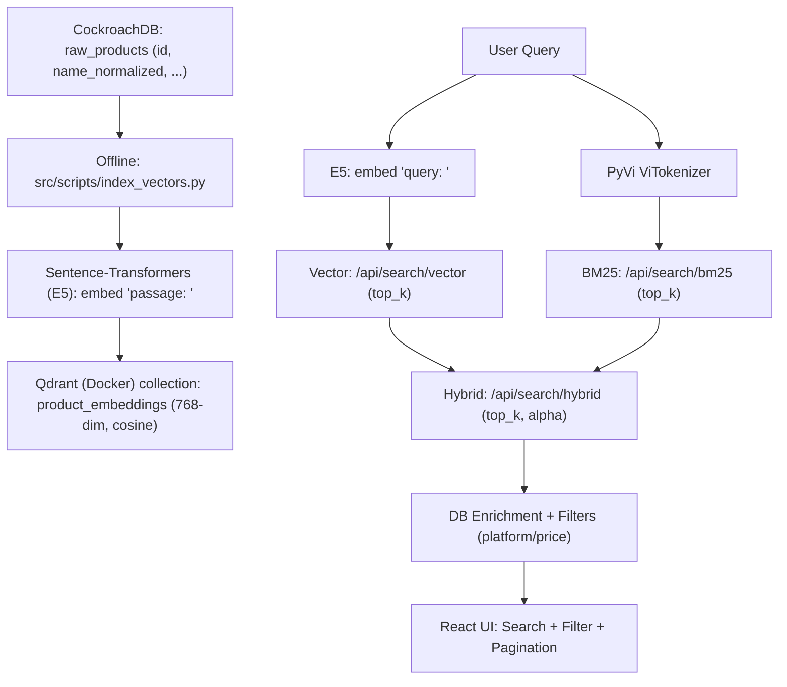

# MILESTONE 3 REPORT: FINAL PRODUCT

**Course:** SEG301 - Search Engines & Information Retrieval  
**Project:** Vertical Search Engine for Vietnamese E-commerce (multi-platform price comparison)  
**Milestone 3 Goal:** Web product + AI (Vector Search) + Hybrid Search + Evaluation (Precision@10).

---

## 1. SYSTEM OVERVIEW (Milestone 3)

- **3 search modes:** BM25 (lexical) / Vector (semantic) / Hybrid (fusion).
- **Dataset scale:** **1,006,666** clean documents (per `README.md`, verified 2026-03-02).

---

## 2. SYSTEM ARCHITECTURE & WORKFLOW

- **Offline (Vector Indexing):** DB → embed → Qdrant.
- **Online (Search):** query → (BM25/Vector/Hybrid) → filter/pagination → UI.

---

## 3. AI FEATURES: VECTOR SEARCH & HYBRID SEARCH (3/3 points)

### 3.1 Vector Search

- **Vector DB:** Qdrant (`docker-compose.yml`), host `localhost:6333`.
- **Embedding model:** `intfloat/multilingual-e5-base` (Sentence-Transformers), **768-dim**, cosine, normalized embeddings.
- **Collection:** `product_embeddings` (`src/ranking/vector.py`).
- **Index script:** `src/scripts/index_vectors.py` (reads `raw_products.id, name_normalized`).

### 3.2 Hybrid Search

- Endpoint: `POST /api/search/hybrid` (`src/router/api_search.py`)
- **Per-query Min-Max normalization** for BM25 & Vector, fused with \(\alpha\) (default 0.5).
- Candidates: each engine retrieves **top \(2 \times top\_k\)** before fusion.

\[
\text{FinalScore}(d) = \alpha \cdot \text{VectorNorm}(d) + (1-\alpha)\cdot \text{BM25Norm}(d)
\]

---

## 4. WEB PRODUCT (3/3 points)

### 4.1 Tech stack (matches the repo)

- **Frontend:** React + TypeScript (Vite) + Tailwind CSS + Recharts (`src/ui/`).
- **Backend:** FastAPI (`app.py`), routers in `src/router/`, prefix `/api`.
- **DB:** CockroachDB (connection pool).

### 4.2 Required Milestone 3 features

- **Search:** UI supports `bm25` / `vector` / `hybrid`.
- **Filter:** platform + price range.
- **Pagination:** implemented in `ResultsPage`.
- **Dashboard:** `GET /api/stats`.

---

## 5. EVALUATION: ADVANCED METRICS (10 HYBRID QUERIES)

- **Dataset for Testing:** 10 benchmark queries extracted from the CockroachDB dataset.
- **Evaluation Mechanism:** **Phrase-based Matching** (lightweight and independent of LLM/S-BERT to eliminate AI hallucinations):
  - **BM25 Targets:** Match the frequency of exact "tokens" extracted from the query within the product name. Score is based on the match percentage.
  - **Vector Targets:** Match complete semantic/category phrases (e.g., "điện thoại thông minh", "màn hình gập"). Presence of at least 1 phrase $\rightarrow$ Perfect score.
  - **Hybrid Rules:** Uses the exact arithmetic mean (\( \frac{\text{BM25} + \text{Vector}}{2} \)) to evaluate multi-dimensional harmony.
- **Metric Calculations:** Precision@10 (P@10), Mean Reciprocal Rank (MRR), and NDCG@10. "Relevant" threshold is $\ge 0.5$.

**Summary Results:**

| Search Method | Avg P@10 | Avg MRR | Avg NDCG@10 | Note |
|:--------------|:--------:|:-------:|:-----------:|:-----|
| **BM25**      | 0.670    | 1.000   | 0.974       | Highest exact model keyword matching accuracy. |
| **VECTOR**    | 0.850    | 0.900   | 0.894       | Captures broad semantic groups, returns many related accessories. |
| **HYBRID**    | **0.870**| **0.900**| **0.986**  | Harmonizes both mechanisms $\rightarrow$ Achieves the highest quality metrics. |

**Metric Calculations Explained:**

- **Avg P@10 (Precision at 10):** Measures the proportion of relevant products in the top 10 results. Calculated as $P@10 = \frac{\sum_{i=1}^{10} \text{rel}_i}{10}$, where $\text{rel}_i = 1$ if the product's Relevance Score $\ge 0.5$, otherwise $0$.
- **Avg MRR (Mean Reciprocal Rank):** Evaluates how quickly the first relevant item appears. Calculated as $MRR = \frac{1}{|Q|} \sum_{q=1}^{|Q|} \frac{1}{\text{rank}_q}$, where $\text{rank}_q$ is the 1-based position (1 to 10) of the *first* relevant product ($\text{Score} \ge 0.5$). If the top result is always perfect (like BM25), Avg MRR is 1.0.
- **Avg NDCG@10 (Normalized Discounted Cumulative Gain):** Measures the ideal ranking quality using the exact float Relevance Scores (from 0.0 to 1.0). It rewards placing highly relevant items at the very top and applies a logarithmic penalty for placing them lower. Calculated as $\text{NDCG} = \frac{\text{DCG}}{\text{IDCG}}$, where $\text{DCG} = \sum_{i=1}^{10} \frac{2^{Score_i} - 1}{\log_2(i + 1)}$ and $\text{IDCG}$ is the ideal sorting scenario. Hybrid achieves the highest NDCG because it correctly sorts perfect matches to the top and relevant accessories to the bottom.
---

## 7. CODE SUMMARY (Milestone 3)

| File | Role |
|:---|:---|
| `docker-compose.yml` | Run Qdrant Vector DB |
| `src/ranking/vector.py` | VectorRanker (E5 embed + Qdrant create/search) |
| `src/scripts/index_vectors.py` | Index `raw_products.name_normalized` into Qdrant |
| `src/router/api_search.py` | BM25/Vector/Hybrid APIs + normalization + fusion + filters |
| `src/router/api_stats.py` | Stats API for dashboard |
| `app.py` | FastAPI bootstrap + DI (BM25, Vector, DB pool) |
| `src/ui/` | React UI (Search/Filter/Pagination/Dashboard) |

---

## 8. CONCLUSION & PRESENTATION (2/2 points)

- **Complete product:** Web UI + Backend API with BM25/Vector/Hybrid, filters, pagination, and dashboard.
- **AI requirement met:** Vector Search (Qdrant + multilingual E5) and Hybrid fusion (\(\alpha\)) improve semantic search quality.
- **Transparent AI logs:** AI interaction logs are included in the repository (e.g., `ai_log_long.md`, `ai_log_*.md`).
