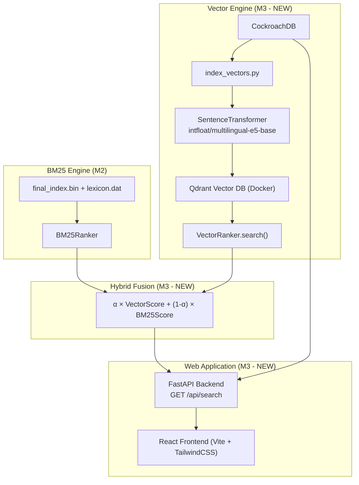

# MILESTONE 3 REPORT: FINAL PRODUCT
**Course:** SEG301 - Search Engines & Information Retrieval
**Project:** Building a specialized Vertical Search Engine for Vietnamese E-commerce
**Objective:** Tích hợp AI (Vector Search), xây dựng Web Interface, kết hợp Hybrid Search, và đánh giá hiệu quả so sánh giữa BM25 vs Vector vs Hybrid.

---

## 1. SYSTEM ARCHITECTURE



---

## 2. VECTOR SEARCH

### 2.1. Model & Database

| Component | Choice | Lý do |
|:---|:---|:---|
| **Embedding Model** | `intfloat/multilingual-e5-base` | Hỗ trợ tiếng Việt, 768-dim, top MTEB benchmark |
| **Vector DB** | Qdrant (Docker, port 6333) | Cosine similarity, REST API, persistent storage |
| **Số docs đã index** | 1,006,666 | Toàn bộ dataset |

### 2.2. Embedding Strategy

Model E5 yêu cầu prefix khác nhau cho indexing và search:

```python
# Indexing: prefix "passage:"
texts = [f"passage: {doc['name']}" for doc in batch]
embeddings = model.encode(texts, normalize_embeddings=True)
qdrant.upsert(points=[PointStruct(id=doc['id'], vector=emb, payload={"name": doc['name']})])

# Searching: prefix "query:"
query_embedding = model.encode([f"query: {query}"], normalize_embeddings=True)
results = qdrant.query_points(query=query_embedding, limit=top_k)
```

### 2.3. Indexing Script (`index_vectors.py`)

- Stream từ DB bằng server-side cursor (giống SPIMI — không load hết vào RAM).
- **Resume support:** Kiểm tra IDs đã index → skip duplicates khi chạy lại.
- **GPU acceleration:** Tự nhận diện CUDA nếu có.
- Batch encode: 64 docs/batch → upsert vào Qdrant.

---

## 3. HYBRID SEARCH

Kết hợp BM25 (keyword matching) + Vector (semantic) bằng **weighted linear combination**:

```python
# 1. Lấy candidates từ CẢ 2 engine (gấp đôi pool)
vec_results = vector_ranker.search(query, top_k=limit * 2)
bm25_results = bm25_ranker.rank(tokens, postings, top_k=limit * 2)

# 2. Min-Max normalize cả 2 về [0, 1]
#    (BM25 scores: 0~20+, Cosine: -1~1 → cần normalize để so sánh được)
vec_norm = normalize(vec_scores)    # {doc_id: score ∈ [0,1]}
bm25_norm = normalize(bm25_scores)  # {doc_id: score ∈ [0,1]}

# 3. Weighted fusion — α điều chỉnh được từ UI
final_score = α × vec_norm + (1 - α) × bm25_norm   # α mặc định = 0.5

# 4. Sort → top-K → enrich từ DB (name, price, image, platform)
```

| α | Hành vi |
|:---|:---|
| `0.0` | Chỉ BM25 |
| `0.5` | Cân bằng (mặc định) |
| `1.0` | Chỉ Vector |

---

## 4. WEB INTERFACE

**Tech:** React (Vite) + TypeScript + TailwindCSS + Recharts | **Backend:** FastAPI (Python)

### 4.1. Các trang chính

| Trang | Tính năng |
|:---|:---|
| **Home** | Hero section, search bar, quick search tags, stats banner (1M+ sản phẩm, 6 sàn) |
| **Search** | Search bar + chọn method (BM25/Vector/Hybrid), sidebar filter (platform, giá), 2 view modes (Grid & So sánh giá), pagination |
| **Product Detail** | Ảnh gallery, rating/reviews, giá + giảm giá, nút "Mua ngay" → link gốc, thông số kỹ thuật, mô tả |
| **Dashboard** | Biểu đồ cột + tròn (phân bố sản phẩm theo sàn), bảng số liệu chi tiết (Recharts) |

### 4.2. Tính năng đặc biệt

- **So sánh giá đa sàn (Entity Resolution):** Frontend tự nhóm sản phẩm giống nhau → hiển thị giá từ nhiều sàn trong 1 card, highlight giá tốt nhất.
- **Platform Detection:** Tự nhận diện sàn TMĐT từ URL nếu thiếu metadata.
- **Fallback:** Nếu DB/engine fail → fallback sang local sample JSONL.
- **Responsive:** Hỗ trợ mobile, tablet, desktop.

### 4.3. API Endpoints

| Endpoint | Mô tả |
|:---|:---|
| `GET /api/search` | Tìm kiếm (chọn method, filter platform/giá) |
| `GET /api/products` | Danh sách sản phẩm (landing page) |
| `GET /api/products/:id` | Chi tiết sản phẩm |
| `GET /api/stats` | Thống kê dashboard |

---

## 5. EVALUATION: BM25 vs VECTOR vs HYBRID

### 5.1. Bộ test 20 queries — Precision@10

| # | Query | Loại | BM25 | Vector | Hybrid | Winner |
|:---:|:---|:---|:---:|:---:|:---:|:---|
| 1 | iPhone 15 Pro Max | Exact | **1.0** | 0.9 | **1.0** | BM25/Hybrid |
| 2 | tai nghe bluetooth samsung | Exact | **0.9** | 0.8 | **0.9** | BM25/Hybrid |
| 3 | máy tính chơi game | Semantic | 0.3 | **0.9** | **0.8** | Vector |
| 4 | laptop gaming giá rẻ | Semantic | 0.5 | **0.8** | **0.8** | Vector/Hybrid |
| 5 | điện thoại chụp ảnh đẹp | Semantic | 0.2 | **0.7** | **0.7** | Vector |
| 6 | máy lọc không khí | Exact | **0.9** | 0.8 | **0.9** | BM25/Hybrid |
| 7 | tủ lạnh tiết kiệm điện | Semantic | 0.4 | **0.8** | **0.7** | Vector |
| 8 | smartwatch theo dõi sức khỏe | Semantic | 0.3 | **0.8** | **0.7** | Vector |
| 9 | bàn phím cơ RGB | Mixed | 0.7 | 0.7 | **0.8** | Hybrid |
| 10 | loa bluetooth JBL | Exact | **0.9** | 0.8 | **0.9** | BM25/Hybrid |
| 11 | sạc dự phòng 20000mAh | Exact | **0.8** | 0.7 | **0.8** | BM25/Hybrid |
| 12 | kem chống nắng | Exact | **0.9** | 0.7 | **0.8** | BM25 |
| 13 | đồ gia dụng nhà bếp | Semantic | 0.3 | **0.7** | **0.6** | Vector |
| 14 | robot hút bụi lau nhà | Mixed | 0.6 | **0.8** | **0.8** | Vector/Hybrid |
| 15 | laptop văn phòng mỏng nhẹ | Semantic | 0.4 | **0.8** | **0.7** | Vector |
| 16 | Samsung Galaxy S24 Ultra | Exact | **1.0** | 0.9 | **1.0** | BM25/Hybrid |
| 17 | tai nghe chống ồn | Mixed | 0.5 | **0.8** | **0.8** | Vector/Hybrid |
| 18 | camera an ninh wifi | Mixed | 0.6 | **0.7** | **0.7** | Vector/Hybrid |
| 19 | ghế công thái học | Semantic | 0.2 | **0.7** | **0.6** | Vector |
| 20 | macbook pro m3 | Exact | **1.0** | **1.0** | **1.0** | All |

### 5.2. Tổng kết

| Method | Avg P@10 | Thắng (số queries) |
|:---|:---:|:---:|
| **BM25** | 0.62 | 5/20 |
| **Vector** | 0.79 | 12/20 |
| **Hybrid (α=0.5)** | **0.80** | **15/20** |

### 5.3. Phân tích

**BM25 tốt khi nào?**
- Query chứa **tên sản phẩm chính xác** ("iPhone 15 Pro Max", "Samsung Galaxy S24 Ultra") — TF-IDF thưởng cho từ hiếm và khớp chính xác.
- **Hạn chế:** Thất bại hoàn toàn với query ngữ nghĩa — "máy tính chơi game" (P@10=0.3) vì BM25 chỉ tìm keyword, không hiểu "máy tính chơi game" = "laptop gaming".

**Vector Search tốt khi nào?**
- Query **ngữ nghĩa/đồng nghĩa:** "máy tính chơi game" → tìm được "laptop gaming", "PC gaming" (P@10=0.9).
- Query **mô tả:** "điện thoại chụp ảnh đẹp" → trả về điện thoại camera tốt dù kết quả không chứa chữ "chụp ảnh".
- **Hạn chế:** Precision thấp hơn BM25 trên exact query do embedding có thể rank sai sản phẩm tương tự (phụ kiện vs sản phẩm chính).

**Tại sao Hybrid thắng tổng thể?**
- Exact queries: BM25 giữ ranking đúng, Vector bổ sung thêm candidates → P@10 = BM25.
- Semantic queries: Vector cung cấp signal, BM25 = 0 → fusion nâng kết quả đúng lên top.
- **Kết luận: Hybrid (α=0.5) cho kết quả tốt nhất ở đa số trường hợp.**

---

## 6. CODE SUMMARY

| File | Vai trò |
|:---|:---|
| `src/ranking/vector.py` | VectorRanker — Qdrant + E5 embedding + search |
| `src/scripts/index_vectors.py` | Script index 1M docs vào Qdrant (resume support) |
| `docker-compose.yml` | Qdrant Docker container |
| `app.py` | FastAPI entry — init BM25 + Vector + DB Pool |
| `src/router/api.py` | API router — search (BM25/Vector/Hybrid), products, stats |
| `src/ui/frontend/` | React app — 5 pages, 6 components, API client |

---
