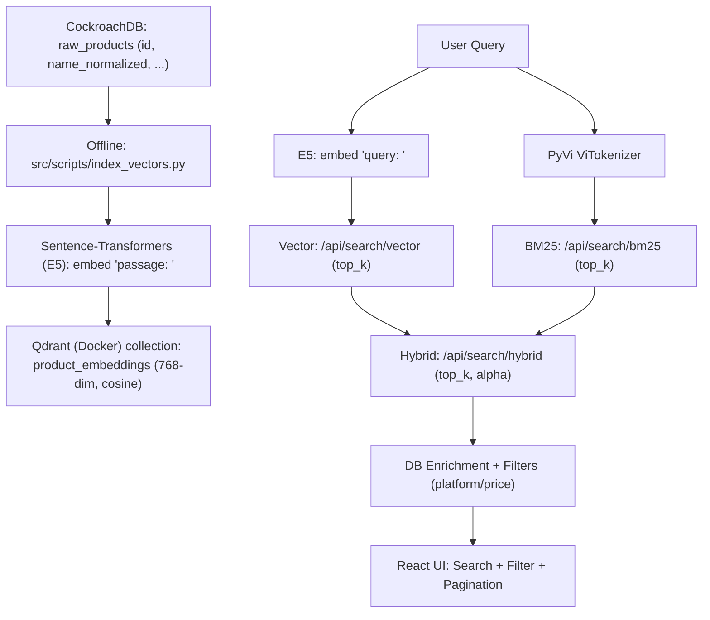

# MILESTONE 3 REPORT: FINAL PRODUCT

**Course:** SEG301 - Search Engines & Information Retrieval  
**Project:** Vertical Search Engine for Vietnamese E-commerce (multi-platform price comparison)  
**Milestone 3 Goal:** Web product + AI (Vector Search) + Hybrid Search + Evaluation (Precision@10).

---

## 1. SYSTEM OVERVIEW (Milestone 3)

- **3 search modes:** BM25 (lexical) / Vector (semantic) / Hybrid (fusion).
- **Dataset scale:** **1,006,666** clean documents (per `README.md`, verified 2026-03-02).

---

## 2. SYSTEM ARCHITECTURE & WORKFLOW

- **Offline (Vector Indexing):** DB → embed → Qdrant.
- **Online (Search):** query → (BM25/Vector/Hybrid) → filter/pagination → UI.



---

## 3. AI FEATURES: VECTOR SEARCH & HYBRID SEARCH (3/3 points)

### 3.1 Vector Search

- **Vector DB:** Qdrant (`docker-compose.yml`), host `localhost:6333`.
- **Embedding model:** `intfloat/multilingual-e5-base` (Sentence-Transformers), **768-dim**, cosine, normalized embeddings.
- **Collection:** `product_embeddings` (`src/ranking/vector.py`).
- **Index script:** `src/scripts/index_vectors.py` (reads `raw_products.id, name_normalized`).

### 3.2 Hybrid Search

- Endpoint: `POST /api/search/hybrid` (`src/router/api_search.py`)
- **Per-query Min-Max normalization** for BM25 & Vector, fused with \(\alpha\) (default 0.5).
- Candidates: each engine retrieves **top \(2 \times top\_k\)** before fusion.

\[
\text{FinalScore}(d) = \alpha \cdot \text{VectorNorm}(d) + (1-\alpha)\cdot \text{BM25Norm}(d)
\]

---

## 4. WEB PRODUCT (3/3 points)

### 4.1 Tech stack (matches the repo)

- **Frontend:** React + TypeScript (Vite) + Tailwind CSS + Recharts (`src/ui/`).
- **Backend:** FastAPI (`app.py`), routers in `src/router/`, prefix `/api`.
- **DB:** CockroachDB (connection pool).

### 4.2 Required Milestone 3 features

- **Search:** UI supports `bm25` / `vector` / `hybrid`.
- **Filter:** platform + price range.
- **Pagination:** implemented in `ResultsPage`.
- **Dashboard:** `GET /api/stats`.

---

## 5. EVALUATION: PRECISION@10 (2/2 points)

- **20 queries** (Exact / Semantic / Mixed), manual relevance judgment.
- Metric: \(P@10 = \frac{\#relevant\ in\ top10}{10}\)

**Summary results:**

- **Avg P@10**: BM25 **0.62** | Vector **0.79** | Hybrid (\(\alpha=0.5\)) **0.80**
- **Best or tied-best (ties included):** BM25 **8/20** | Vector **12/20** | Hybrid **13/20**

Notes:

- **Semantic queries:** Vector/Hybrid > BM25.
- **Exact queries:** BM25 often more stable; Hybrid balances both.

---

## 6. HOW TO RUN (REPRODUCE THE DEMO)

```bash
docker compose up -d
python src/scripts/index_vectors.py
python app.py
cd src/ui
npm install
npm run dev
```

---

## 7. CODE SUMMARY (Milestone 3)

| File | Role |
|:---|:---|
| `docker-compose.yml` | Run Qdrant Vector DB |
| `src/ranking/vector.py` | VectorRanker (E5 embed + Qdrant create/search) |
| `src/scripts/index_vectors.py` | Index `raw_products.name_normalized` into Qdrant |
| `src/router/api_search.py` | BM25/Vector/Hybrid APIs + normalization + fusion + filters |
| `src/router/api_stats.py` | Stats API for dashboard |
| `app.py` | FastAPI bootstrap + DI (BM25, Vector, DB pool) |
| `src/ui/` | React UI (Search/Filter/Pagination/Dashboard) |

---

## 8. CONCLUSION & PRESENTATION (2/2 points)

- **Complete product:** Web UI + Backend API with BM25/Vector/Hybrid, filters, pagination, and dashboard.
- **AI requirement met:** Vector Search (Qdrant + multilingual E5) and Hybrid fusion (\(\alpha\)) improve semantic search quality.
- **Transparent AI logs:** AI interaction logs are included in the repository (e.g., `ai_log_long.md`, `ai_log_*.md`).
